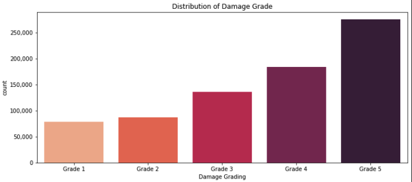

## MVP Overview

### Goal:
- To predict earthquake damage to buildings using 2015's 7.8 Mw Gorkha Earthquake data.

### Scope: 
- Following the 7.8 Mw Gorkha Earthquake on April 25, 2015, Nepal carried out a massive household survey using mobile technology to assess building damage in the 11 most affected districts. This project uses this data to build a classification model.

### Process:

- Imported csv files into SQLite database and used SQLAlchemy to bring into python
- Performed EDA and dropped null and invalid year rows taking the dataframe shape from (762106, 42) to (758949, 42) reducing rows by a small 0.04%.
- Used one-hot encoding to transform categorical columns with the resulting dataframe shape being (758949, 69)
- The models tested so far are outlined in the results section.
- F1 scoring with micro averaging was used to compare models

 

### EDA:

Damage Grade distribution:

Grade 5 damage geographical distribution:

 

### Preliminary Results:
F1 scores using micro average

 

Confusion matrix

 

### Discussion:
- Predictions seem to be leaning toward Grade 5 damage, this could be addressed through treating class imblance.
- There were merits to both recall and precision scoring. Using recall to avoid false negatives would be appropriate from a humanitarian perspective to avoid declaring a building is safe when it may be badly damaged. On the other hand precision may be better suited from a cost perspective to avoid false positives i.e. predicting that everything will collapse and setting aside excess money for rebuilding. Therefore F1 scoring, a balance of the two was chosen in this instance. This approach may be refined further down the track.
- Micro averaging was implemented as it counts each and every TP, FN and FP irrespective of class imbalance. This was deemed suitable as the highest damage class makes up a big proportion of the population. (i.e. you may want to use macro or weighted if you want to take class imbalance into account).
- Binary model was not granular enough and it may be costly from a business perspective, as you only have 2 extreme outcomes.

 

### Further development:
- Treat class imbalance
- Try different tree models Random Forest Regression
- Perform more feature engineering to improve the score.
- Choose the best model and deploy in streamlit